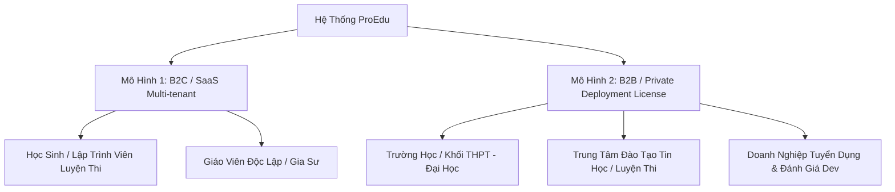

# KẾ HOẠCH THƯƠNG MẠI HOÁ HỆ THỐNG PROEDU

---

## 1. TỔNG QUAN HỆ SINH THÁI SẢN PHẨM

Hệ thống **ProEdu** hiện sở hữu 4 trụ cột tính năng cốt lõi có giá trị thương mại rất cao:
1. **Luyện Lập Trình & Thi Đấu Trực Tuyến (Online Judge)**: Chấm code tự động, quản lý testcase, kỳ thi lập trình, bảng xếp hạng Real-time.
2. **Khảo Thí & Thi Trắc Nghiệm Trực Tuyến**: Ngân hàng câu hỏi, tạo đề thi ma trận tự động, thi có giám sát, trộn đề thông minh.
3. **Công Cụ AI & Số Hoá Tài Liệu**: Chuyển đổi công thức toán/PDF/ảnh sang Word $\LaTeX$ chuẩn.
4. **Chấm Điểm Tự Động Bằng Thị Giác Máy Tính (OpenCV)**: Nhận diện & chấm phiếu trắc nghiệm qua ảnh chụp.

---

## 2. CHI TIẾT 2 HƯỚNG THƯƠNG MẠI HOÁ



---

### HƯỚNG 1: B2C – NGƯỜI DÙNG TRẢ TIỀN THEO GÓI / NĂM (SaaS Subscription)

> **Mô hình**: Vận hành tập trung trên Cloud của bạn. Người dùng cá nhân (học sinh, giáo viên, lập trình viên) tự đăng ký tài khoản và mua gói định kỳ (Tháng / Năm).

#### A. Phân tầng các gói dịch vụ B2C

| Gói Dịch Vụ | Đối Tượng | Mức Giá Đề Xuất | Quyền Lợi & Hạn Mức Tính Năng |
| :--- | :--- | :--- | :--- |
| **Gói MIỄN PHÍ (Free/Freemium)** | Học sinh, người mới | **0 VNĐ** | - Làm các bài luyện code cơ bản.<br>- Tham gia các kỳ thi mở công khai.<br>- Giới hạn 5 lần chuyển đổi AI LaTeX/tháng.<br>- Xem bảng xếp hạng chung. |
| **Gói HỌC SINH / PRO DEV** | Học sinh luyện HSG, sinh viên CNTT | **299.000 – 499.000 VNĐ / năm** | - Mở khoá toàn bộ bài tập nâng cao (HSG, ICPC, OLP).<br>- Xem lời giải mẫu (Editorial) & Testcase ẩn khi làm sai.<br>- Không giới hạn số lần nộp bài.<br>- Thống kê chi tiết biểu đồ tiến độ năng lực cá nhân. |
| **Gói GIÁO VIÊN / KHẢO THÍ** | Giáo viên, gia sư, người dạy tự do | **890.000 – 1.490.000 VNĐ / năm** | - Đầy đủ quyền lợi gói PRO.<br>- Tạo ngân hàng câu hỏi riêng (tối đa 2.000 câu).<br>- Tổ chức phòng thi trắc nghiệm (tối đa 200 học sinh/lần).<br>- Tạo kỳ thi Luyện Code riêng cho lớp học.<br>- Chuyển đổi ảnh/PDF sang Word LaTeX: 100 trang/tháng.<br>- Chấm phiếu trắc nghiệm OpenCV: Không giới hạn. |

#### B. Cơ chế thanh toán & Tự động gia hạn
- Tích hợp cổng thanh toán tự động: **VietQR Pro (PayOS / SePay)** hoặc **MoMo / VNPAY / Stripe**.
- Quét mã QR chuyển khoản $\rightarrow$ Hệ thống tự động đối soát Webhook $\rightarrow$ Nâng cấp tài khoản VIP ngay lập tức trong 3 giây.

---

### HƯỚNG 2: B2B – TRIỂN KHAI HỆ THỐNG TRẢ TIỀN THEO NĂM (Enterprise License & Dedicated Cloud)

> **Mô hình**: Cung cấp toàn bộ giải pháp cho Trường học, Trung tâm luyện thi, Sở/Phòng GD&ĐT hoặc Doanh nghiệp đào tạo dưới tên miền và thương hiệu riêng (White-label). Khách hàng trả phí duy trì bản quyền & máy chủ hàng năm.

#### A. Phân tầng gói triển khai B2B

| Gói Triển Khai | Quy Mô Phù Hợp | Mức Giá Bản Quyền / Năm | Dịch Vụ Đi Kèm |
| :--- | :--- | :--- | :--- |
| **Gói TRUNG TÂM (Standard)** | Trung tâm Tin học, Trường tư vừa (< 500 học sinh) | **15.000.000 – 25.000.000 VNĐ / năm** | - Triển khai trên Cloud riêng (VPS/Cloud Server).<br>- Tên miền & Logo thương hiệu riêng (White-label).<br>- Quản lý tối đa 500 tài khoản học sinh + 20 giáo viên.<br>- Hỗ trợ kỹ thuật & Backup dữ liệu định kỳ tuần. |
| **Gói TRƯỜNG HỌC (Campus)** | Trường THPT, Cao đẳng, ĐH (500 - 2.500 học sinh) | **35.000.000 – 60.000.000 VNĐ / năm** | - Triển khai máy chủ hiệu năng cao hoặc hạ tầng On-premise của trường.<br>- Tách biệt Server Sandbox chấm code riêng biệt.<br>- Phân quyền chặt chẽ: BGH, Tổ trưởng chuyên môn, Giáo viên, Học sinh.<br>- Tích hợp dữ liệu danh sách học sinh từ file Excel trường.<br>- Đào tạo tập huấn giáo viên & Support 24/7. |
| **Gói SỞ / TẬP ĐOÀN (Custom)** | Nhiều cơ sở, Sở GD, Kỳ thi cấp Tỉnh | **100.000.000+ VNĐ / năm** | - Cụm máy chủ chịu tải cao (Load Balancer, Redis Cluster, Multi-worker Judge).<br>- Tính năng tuỳ biến riêng theo thể lệ hội thi.<br>- Chống gian lận nâng cao (Lockdown browser, Webcam giám sát). |

#### B. Cơ chế kiểm soát bản quyền (Licensing System)
- **License Key mã hoá RSA / Hardware ID**: Hệ thống kiểm tra key bản quyền định kỳ theo năm qua Server License trung tâm.
- **Tenant Expiration Watchdog**: Tự động cảnh báo trước 30 ngày khi sắp hết hạn hợp đồng bảo trì/bản quyền hàng năm.

---

## 3. CÁC NÂNG CẤP KỸ THUẬT CẦN THỰC HIỆN

Để thương mại hoá ổn định và an toàn, cần bổ sung các module kỹ thuật sau:

```
┌────────────────────────────────────────────────────────┐
│                   HỆ THỐNG PROEDU                      │
├────────────────────────┬───────────────────────────────┤
│    MODULE KINH DOANH   │       MODULE HẠ TẦNG          │
│  - Quản lý Gói (Plan)  │  - Sandbox chấm code (Docker) │
│  - Thanh toán QR/Hook  │  - Giới hạn tài nguyên (Rate) │
│  - License Activation  │  - Multi-tenant / Database    │
│  - Hoá đơn & Gia hạn   │  - Backup & Security Monitor  │
└────────────────────────┴───────────────────────────────┘
```

1. **Quản lý Gói & Hạn mức (Billing & Quota Engine)**:
   - Thêm bảng `UserSubscription`, `Plan`, `Transaction`.
   - Middleware kiểm tra quyền truy cập tính năng (VD: user thường không được xem bài nâng cao / giáo viên vượt quá 200 câu hỏi thì yêu cầu nâng cấp).
2. **Sandbox chấm Code an toàn (Secure Judge Worker)**:
   - Tách worker chấm code chạy trong **Docker Container** riêng biệt, giới hạn RAM (128MB - 512MB), CPU (1-2s), cấm truy cập mạng và file hệ thống để tránh bị hack khi mở dịch vụ ra công chúng.
3. **Cổng thanh toán tự động (VietQR / PayOS / MoMo)**:
   - Module sinh mã QR tự động theo từng đơn hàng/user id để tự kích hoạt gói ngay sau khi chuyển khoản.
4. **Kiến trúc Multi-tenant cho B2B**:
   - Khả năng cấu hình màu sắc, Logo, favicon, tiêu đề trường học dễ dàng trong Admin Settings.

---

## 4. KẾ HOẠCH HÀNH ĐỘNG & LỘ TRÌNH TRIỂN KHAI (ROADMAP)

### Giai đoạn 1: Chuẩn bị nền tảng & Bảo mật (1 - 2 tuần)
- Hoàn thiện Docker Sandbox cho bộ chấm code trực tuyến (đảm bảo an toàn tuyệt đối).
- Thiết kế Data Model cho Gói đăng ký (`Plan`, `Subscription`, `Transaction`).
- Tạo trang Landing Page giới thiệu các gói tính năng và bảng so sánh giá.

### Giai đoạn 2: Tích hợp Thanh toán & Quản lý bản quyền (1 - 2 tuần)
- Tích hợp cổng thanh toán quét mã VietQR tự động kích hoạt.
- Xây dựng hệ thống sinh và kiểm tra `License Key` cho khách hàng B2B triển khai riêng.
- Hoàn thiện giao diện cấu hình White-label (Logo, Tên trường, Banner).

### Giai đoạn 3: Tiếp cận thị trường (Go-To-Market)
- **Kênh B2C**:
  - Chạy chương trình tặng tài khoản Pro 1 tháng cho các nhóm học sinh thi HSG Tin, CLB Lập trình.
  - Chia sẻ các bộ đề trắc nghiệm và đề luyện HSG chất lượng cao để kéo người dùng.
- **Kênh B2B**:
  - Chuẩn bị Slide chào hàng (Pitch Deck) và Demo trực tiếp cho các Trường THPT / Trung tâm Tin học.
  - Cung cấp gói dùng thử 30 ngày miễn phí cho 1 trường/trung tâm để làm Case Study thực tế.
